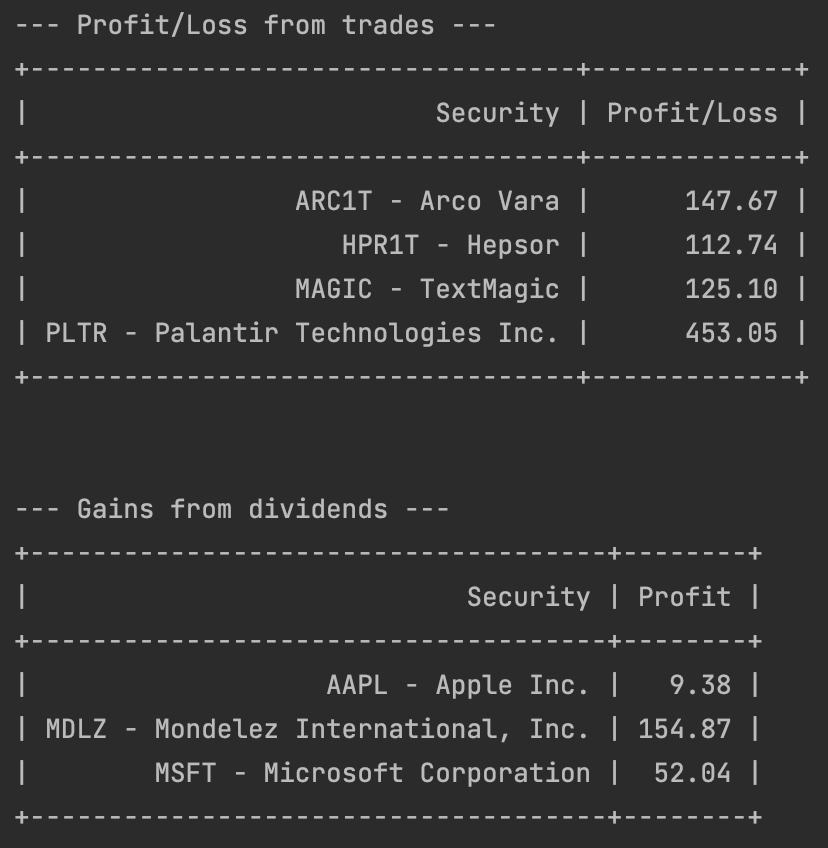

# lhv-profit-loss-summarizer

LHV online bank lists all realized profits by individual trade transactions. 
This makes it difficult to get a profit/loss summary for each stock symbol.
This script can be used to summarize the realized profit/loss report as well as dividends received.

## Prerequisites

Before running the script make sure you have downloaded the `PrettyTable` module: 

    python -m pip install -U prettytable

## Using the script

* Export your statement for the necessary period in `.csv` format and drop into project root directory.
* Run the script, and you have yourself a summary of the report!

### Example output:

